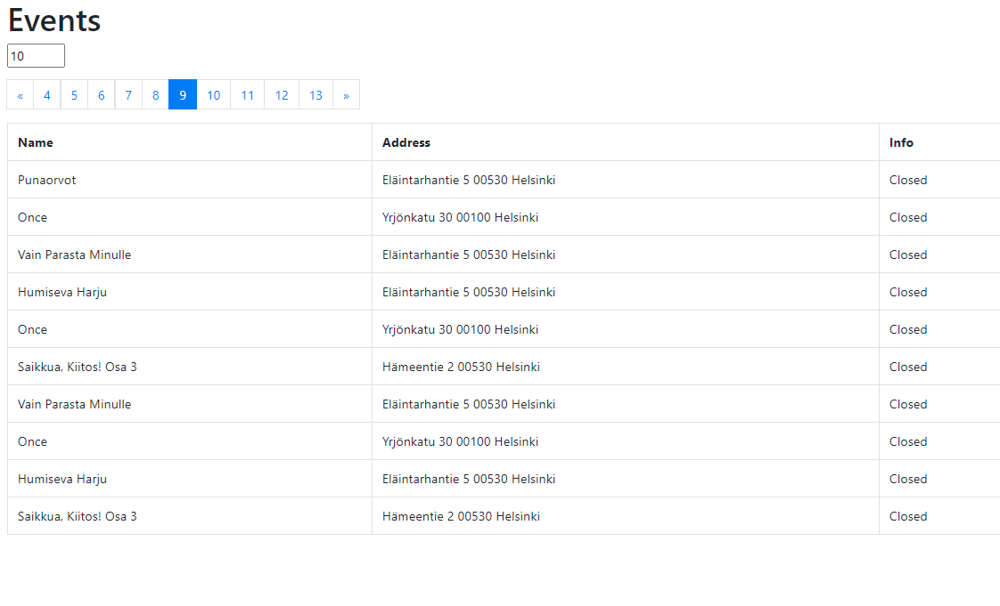

# Events
* Front-end React
* Back-end Springboot

# Front-end

* Fetch data from back-end
* Lists Name, Address and Info into a table
* Pagination of size 10
* Page size as input (0-50)

# Back-end

* Read JSON from MyHelsinki Open API: http://open-api.myhelsinki.fi/v1/events/
* Map wanted data to domain model
* Return event data with API commands

Sources: https://www.danvega.dev/blog/2017/07/05/read-json-data-spring-boot-write-database/

## To-do
* Fetch new data from MyHelsinki Open API and replace current data at scheduled times

